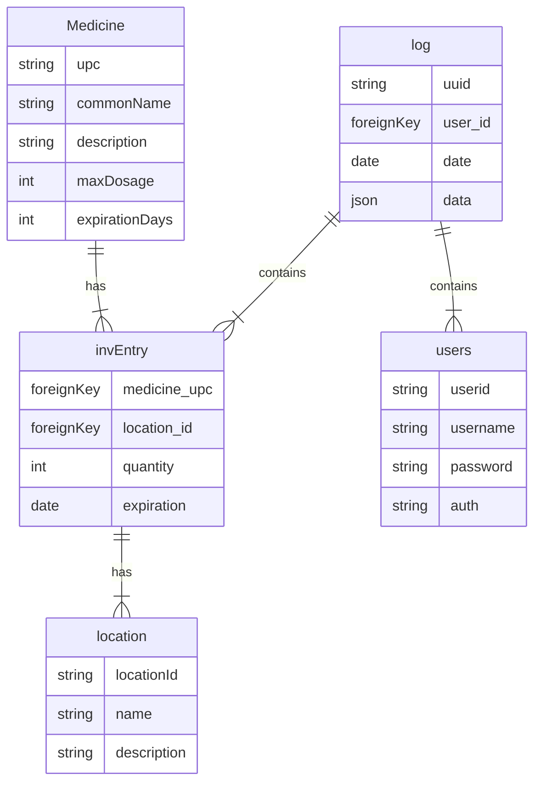

# JJS Inventory CLI

A command-line tool for managing medical inventory and viewing logs, connecting directly to the JJS MySQL database over Tailscale.

---

## Prerequisites

- Python 3.8+
- Tailscale installed and authenticated
- Access to `jjs-mis.tail6e1087.ts.net` on port 3306
- `classTypes.py` present in the same directory

```bash
pip install mysql-connector-python
```

---

## Usage

```bash
python flower/database.py
```

```
----------------------------------------
Options:
1. View Inventory
2. View Logs
3. Add Inventory
4. Remove Inventory
Select an option:
```

---

## Features

**View Inventory** - Fetches all inventory records and prints them as an aligned table.


**View Logs** - Fetches and displays the full activity log.


**Add Inventory** - Prompts for User ID, Product ID, location, quantity, expiration date (year/month/day), and item name, then using the classTypes.py will either insert or update the inventory, and add a log.


**Remove Inventory** - Prompts for the same fields (minus item name) and removes or decrements the matching batch by expiration date and will add a log entry of this.


**Demo** - https://drive.google.com/file/d/1hYcV-aSyKBXhjdgdpHIDrkgoNdiqLyV4/view?usp=drive_link

---

## Database Schema



### Table Descriptions

**`Medicine`** — Master list of medical products. Each entry has a UPC, a common name, a description, maximum dosage, and expected shelf life in days.

**`location`** — Named storage locations within the facility (e.g. cabinet, shelf, room).

**`invEntry`** — Current stock. Links a medicine to a location with a quantity and expiration date for that specific batch.

**`log`** — Audit trail. Every inventory action is recorded here with the acting user, date, and a JSON payload describing what changed.

**`users`** — User accounts. Stores login credentials and an auth field for role/permission level.

---

## Known Limitations

- Requires Tailscale to be active; no offline or local fallback.

## Reflection

A lot of the ease of maming this was due to how robust classTypes.py is. I wish I had been more able to actually use it and update it as needed.